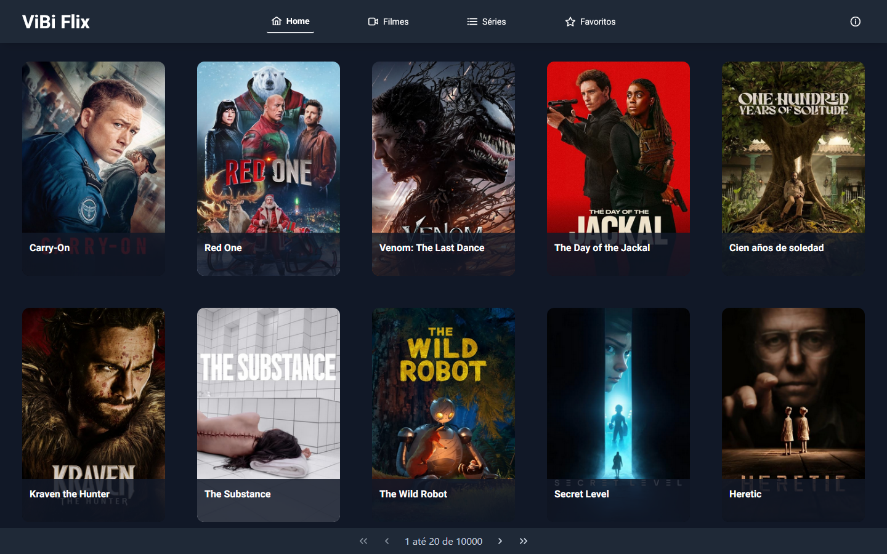
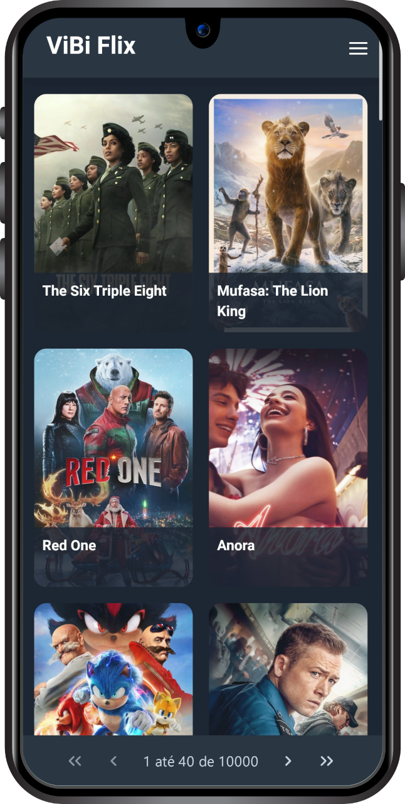
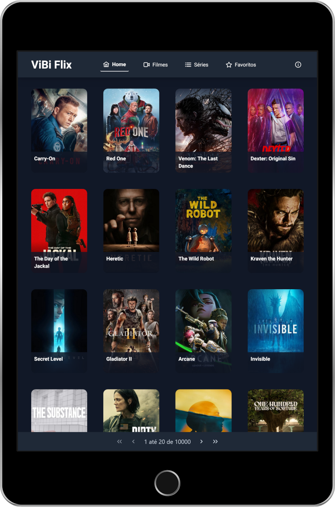
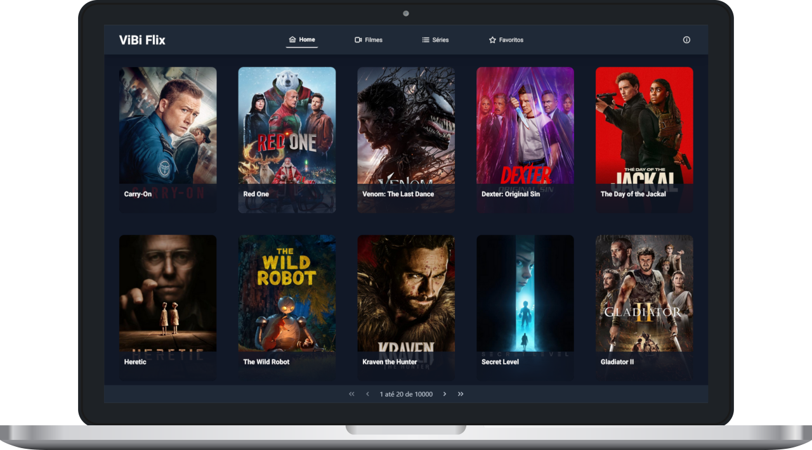

# ViBi Flix

<div align="center">
     
</div>
<div align="center">
    ViBi Flix: Visual Interface
</div>

## Description

> A responsive streaming platform built with Vue.js, leveraging the TMDB public API. This project was developed as part of the TIC 12 Technological Residency Program (RESTIC 12).

## Table of Contents

- [Objective](#objective)
- [Features](#features)
- [Tools](#tools)
- [Project Structure](#project-structure)
- [Demo](#demo)
- [Developers](#developers)

---

## Objective

- Develop a platform capable of consuming the TMDB public API to retrieve data on popular movies and TV series.

## Features

- Information view about popular movies and tv series.
- View updated information about popular movies and TV series.
- Add and remove movies and TV series to/from favorites.
- Watch trailers directly on the platform.
- Responsive design optimized for desktop, tablet, and mobile screens.

## Tools


## Project Structure

```
📁 src/                 # Directory containing all project files.
│
├───📁 assets/          # Contains static files such as images, fonts, and icons.
│
├───📁 components/      # Stores reusable UI components used across the application.
│
├───📁 model/           # Defines interfaces and types for managing application data structures.
│
├───📁 modules/         # Organizes related functionality and global application components.
│
├───📁 router/          # Manages application routes and navigation logic.
│
├───📁 service/         # Contains the application's service layer for API requests and data handling.
│   │
│   ├───📁 rest/        # Contains service files for making REST API calls.
│
├───📁 utils/           # Includes utility functions and helpers for common operations.
│
├───📁 views/           # Contains the application's main pages and views.
│   │
│   ├───📁 Favorites/   # The view for displaying the user's favorite movies and series.
│   │
│   ├───📁 Home/        # The view for displaying the homepage content.
│   │
│   ├───📁 Movies/      # The view for displaying the movies section.
│   │
│   └───📁 Series/      # The view for displaying the series section.
│
├───📄 App.vue          # The root component that serves as the application's main container.
│
└───📄 main.ts          # The entry point that sets up and initializes the Vue application.
```

## Demo

<div align="center">
     
</div>
<div align="center">
    ViBi Flix: Mobile Version
</div>
<br />
<br />

<div align="center">
     
</div>
<div align="center">
    ViBi Flix: Tablet Version
</div>
<br />
<br />

<div align="center">
     
</div>
<div align="center">
    ViBi Flix: Desktop Version
</div>
<br />
<br />

You can explore the ViBi Flix streaming platform [here](https://vibi-flix.onrender.com/).

## Developers

>[Beatriz Monteiro](https://github.com/thebiatriz)

>[Vitor Pires](https://github.com/vikpires)

  

